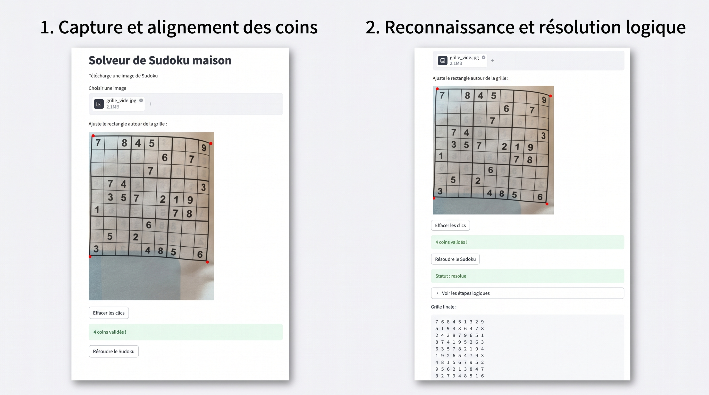

# Sudoku Scanner

> Projet personnel en cours (v0.1) — voir « Limites » et « Prochaines étapes ».

Photographier une grille de Sudoku, obtenir sa lecture, sa solution
et les étapes logiques pour la résoudre, sans saisir les chiffres à la main.

## Fonctionnement

photo → 4 coins placés par l'utilisateur → redressement de perspective
→ 81 vignettes → CNN (vide, 1–9) → seuil de confiance → solveur logique → étapes

- **Lecture** : ResNet léger écrit en PyTorch, entraîné sur
  [sudoku-image-recognition](https://huggingface.co/datasets/Lexski/sudoku-image-recognition)
  (1 000 grilles d'entraînement, soit ~81 000 cases).
- **Résolution** : techniques logiques (singletons, paires, X-Wing),
  puis backtracking en dernier recours.

## Résultats

| Mesure | Valeur |
|---|---|
| Exactitude par case (test, 200 grilles) | ~99,5 % |
| Grilles entièrement bien lues (test) | 90 % |
| Solveur : placements erronés sur 500 grilles de référence | 0 |
| Grilles résolues par la logique seule | 64 % |

Si les erreurs étaient indépendantes, 99,5 % par case ne donnerait
qu'environ 67 % de grilles parfaites. Les 90 % mesurés montrent que
les erreurs se concentrent sur quelques grilles difficiles.

## Lancer le projet

uv sync
uvicorn main:app
uv run streamlit run app_frontend.py

## Limites

- Les cases incertaines sont détectées par l'API mais pas encore affichées.
- Le seuil porte sur le softmax brut, non calibré.
- Les coins de la grille sont placés à la main.
- Pas encore de tests automatisés ni de Docker.
- L'indicateur de difficulté est provisoire.

## Prochaines étapes

Afficher les cases incertaines et demander confirmation avant de résoudre,
calibrer la confiance, ajouter des tests, conteneuriser.
